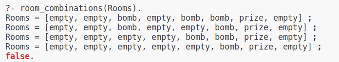

# challenge #45

1. Purely analytical solution: https://docs.google.com/document/d/1HN0qQ9b6xH41UOf8INlWiHOSvK3Kru4d5u8KusjfkqM/edit#heading=h.4nkkajno3svq
2. Numerical solution:
    * The standard way is to use backtracking, the number of possible options is 8 * 128 for Brute Force solution
    * We can apply our filtering criteria as early as possible to avoid additional calculations
3. Other alternatives:
   * Mix of analytical approach
   * Use the languages like Prolog to numerically make the same as in (1) - see prolog/solution.pl
      
     
